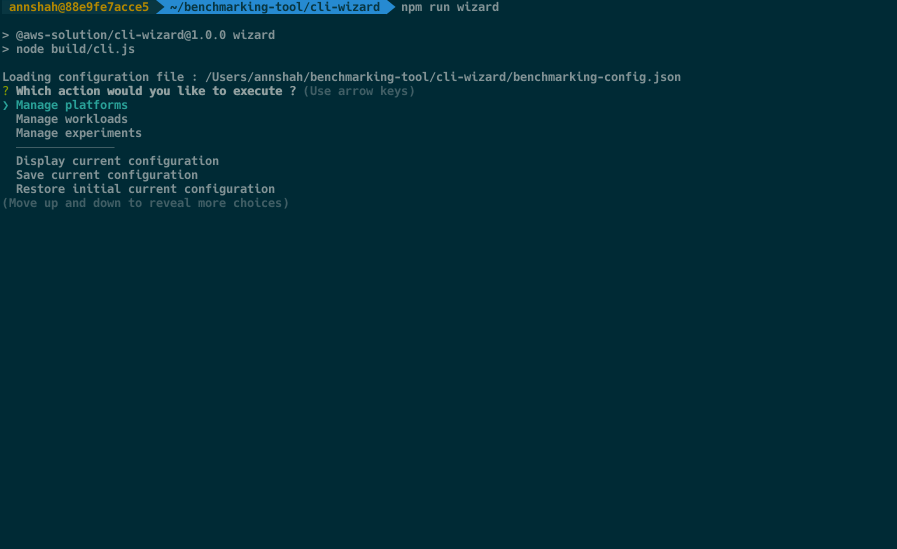
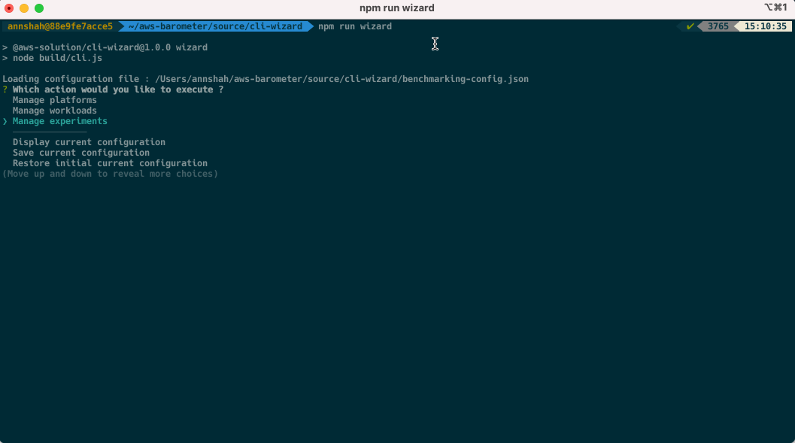
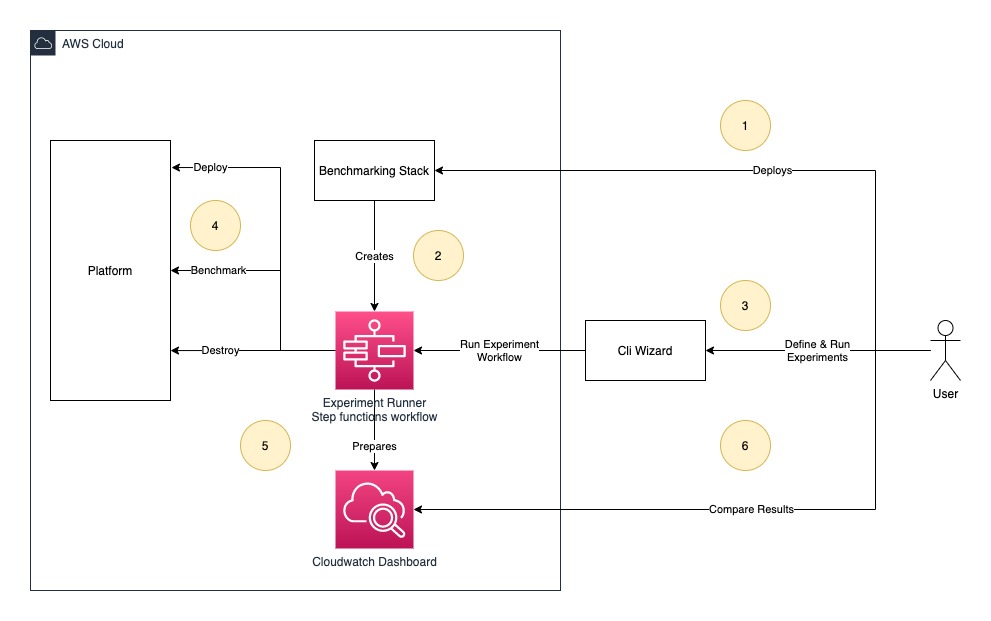

# AWS Barometer

> A tool to automate analytic platform evaluations

AWS Barometer helps customers to get data points needed for service selection/service configurations for given workload.
Benchmarking tool is created by [AWS Prototyping team (EMEA)](https://w.amazon.com/bin/view/AWS_EMEA_Prototyping_Labs)
based
on [this narrative](https://amazon.awsapps.com/workdocs/index.html#/document/760aa6dceb39082084f710abccf4d973b4156f1ec912acb2270c918656025731)
.

## 📋 Table of content

- [Description](#-description)
- [Use cases](#-use-cases)
- [Pre-requisites](#-pre-requisites)
- [Installing](#-installing)
- [Deployment](#-deployment)
- [Quickstart](#-quickstart)
- [Run Benchmark Only](#run-benchmark-only)
- [Bring your own workload](#bring-your-own-workload)
- [Architecture](#-architecture)
- [Cleanup](#-cleanup)
- [See Also](#-see-also)

## 🔰 Description

AWS Barometer will deploy [cdk](https://aws.amazon.com/cdk/) stack which is used to run benchmarking experiments. The
experiment is a combination of [platform](./source/cdk-stack/platforms) and [workload](./source/cdk-stack/workloads)
which can be defined using [cli-wizard](./source/cli-wizard) provided by AWS Barometer tool. Example running experiment
in QuickStart.

## 🛠 Use cases

- Comparison of service performance: Redshift vs Redshift Spectrum
- Comparison of configurations: Redshift dc2 vs ra3 node type
- Performance impact of feature: Redshift AQUA vs Redshift WLM
- Right tool for the job selection: Athena vs Redshift for given workload
- [Registering your custom platform](./source/cdk-stack/platforms): Redshift vs My Own Database
- [Registering your custom workload](./source/cdk-stack/workloads): My own dataset vs Redshift
- Run benchmarking only

AWS Barometer supports below combinations as experiment

- Supported platforms:
    - [Redshift](./source/cdk-stack/platforms/redshift)
- Supported workloads:
    - [TPC-DS/v3](./source/cdk-stack/workloads/tpc-ds) (Volumes: 1 GB)

## 🎒 Pre-requisites

- [mvn](https://maven.apache.org/install.html) with JDK 8 or higher available in current environment
- [npm](https://nodejs.org/en/download/)
- AWS cdk cli: `npm install -g aws-cdk`
- [Aws cli](https://docs.aws.amazon.com/cli/latest/userguide/cli-chap-install.html) configured for target AWS_ACCOUNT &
  AWS_REGION for deploying the tool
- [jq](https://stedolan.github.io/jq/download/) tool installed & available in current environment

## 🚀 Installing

1. Clone the repository https://gitlab.aws.dev/aws-emea-prototyping/data-analytics/reusable-assets/aws-barometer
2. Go to the folder deployment `cd deployment`

## 🎮 Deployment

Set below environment variables if not set already in bash/cli session

```bash
# For Linux or MacOS
# Example:
# export CDK_DEPLOY_ACCOUNT=123456789
# export CDK_DEPLOY_REGION=eu-west-1
export CDK_DEPLOY_ACCOUNT=Aws account id to deploy the tool
export CDK_DEPLOY_REGION=Aws region to deploy the tool

# For Windows
SET CDK_DEPLOY_ACCOUNT=Aws account id to deploy the tool
SET CDK_DEPLOY_REGION=Aws region to deploy the tool
```

With aws cdk cli installed, run deploy

```shell
./deploy.sh # For Linux or MacOS use deploy.sh, For Windows use deploy.bat
```

Once `BenchmarkingStack` is deployed successfully run cli-wizard to run experiments.

```shell
# Set CDK_DEPLOY_ACCOUNT, CDK_DEPLOY_REGION again if using different terminal window
cd cli-wizard
npm run wizard
```

## 🎬 Quickstart



## Run benchmark only

You can directly benchmark any database with this option. The option is available
under `Manage Experiments > Run benchmarking only`. Depending on where the database is hosted you need to follow below
steps as prerequisites to use run benchmark only option.



### If database and AWS Barometer is in the same VPC

1. Create a new secret manager secret having values in below defined json format. All properties are case-sensitive and
   required except `dbClusterIdentifier`

```json
{
  "username": "database-user",
  "password": "*******",
  "engine": "redshift",
  "host": "my-database-host.my-domain.com",
  "port": 5439,
  "dbClusterIdentifier": "redshift-cluster-1",
  "dbname": "dev"
}
```

2. Add tag to the secret for AWS Barometer to have permissions to use it Tag name = `ManagedBy`, Tag Value
   = `BenchmarkingStack`
3. Upload your benchmarking queries to the `DataBucket` (Bucket created by BenchmarkingStack, available as Output) in
   new folder with any name (for example: `my-benchmarking-queries`). Note: the queries can have any name and will be
   executed in sorted order of their names.

```
s3://benchmarkingstack-databucket-random-id
    my-benchmarking-queries
    |
    | +-- query1.sql
    | +-- query2.sql
```

4. Allow network connection from `QueryRunnerSG` (Available as Output of BenchmarkingStack) to your database security
   group

### If database and AWS Barometer is not in the same VPC

In addition to the steps 1,2 and 3 mentioned above (both in the same VPC), follow below steps to
Establish [VPC Peering](https://docs.aws.amazon.com/vpc/latest/peering/what-is-vpc-peering.html)
connection between BenchmarkingVPC and the VPC where database is hosted.

1. Go to VPC console > Peering connection menu from left navigation
2. Create new Peering connection selecting both VPCs (BenchmarkingVPC and DatabaseVPC)
3. Accept peering connection request from Action menu
4. Go to the VPC > Route tables and select any route table associated with BenchmarkingStack subnet
5. Add new route with Destination = CIDR range of the DatabaseVPC and Target = Peering connection id (starts
   with `pcx-`)
6. Repeat steps 4 and 5 for route table associated with BenchmarkingStack second subnet
7. Go to the VPC > Route tables and select route table associated with DatabaseVPC subnet (if using default VPC select
   the only route table available)
8. Add new route with Destination = `10.0.0.0/16` and Target = Peering connection id (starts with `pcx-`)
9. Follow last `step 4 - allow network connection` from `both in the same VPC` above.

## Bring your own workload

You can bring your own workload for benchmarking to AWS Barometer. In this context, workload is defined as files
arranged in specific structure on your s3 bucket. To bring your own workload for the benchmarking you need to follow
below steps as prerequisites.


1. Prepare workload on your s3 bucket. It should contain folder structure as defined below. You can create folder with
   the name of your workload (ex: `my-workload`) at any level in your s3 bucket. The root of your workload folder should
   have three sub-directories called `volumes`, `ddl` and `benchmarking-queries`.
    1. `volumes` sub-directory: this directory contains scale factor for your workload. for example your workload may
       have dataset available in `1gb`, `50gb` and `1tb` scales. You can create as many scale factors as you want with
       minimum one. Within each scale factor sub-directory you should have directory matching `table name` with all
       table data in `.parquet` format under it.
    2. `ddl` sub-directory: this directory contains ddl-scripts to create tables respective to the platform in question.
       For example, ddl-scripts for `redshift` platform should go under redshift folder and ddl specific to `mysql`
       should be placed under its own directory matching with platform name. You can place more than one ddl scripts
       too, they will be executed in order of their names.
    3. `benchmarking-queries` sub-directory: this directory contains benchmarking queries with respect to the platform
       in question. You can place more than one benchmarking-query files, they will be executed in order of their names
       per user session.

```
# Requires my-workload (can be any name) to follow convention on s3 bucket

    my-workload
    |  +-- volumes
    |      |  +-- 1gb
    |      |      |  +-- table_name_1
    |      |      |      |  +-- file-1.parquet
    |      |      |      |  +-- file-2.parquet
    |      |      |  +-- table_name_2
    |      |      |      |  +-- file-1.parquet
    |      |      |      |  +-- file-2.parquet
    |  +-- ddl
    |      |  +-- redshift
    |      |      |  +-- ddl.query1.sql
    |      |      |  +-- ddl.query2.sql
    |      |  +-- mysql
    |      |      |  +-- ddl.query.sql
    |  +-- benchmarking-queries
    |      |  +-- redshift
    |      |      |  +-- query1.sql
    |      |      |  +-- query2.sql
    |      |  +-- mysql
    |      |      |  +-- query1.sql
    |      |      |  +-- query2.sql

```

2. Run the cli-wizard and go to `Manage workload > Add new workload` to import your workload. Wizard will validate and
   import workload if structure validation is successful.
3. Wizard will print `bucket policy` while importing your workload. Please update your s3 bucket's bucket policy with
   printed one.

## Architecture

### User flow



1. User deploys AWS Barometer Benchmarking Stack
2. AWS Barometer Benchmarking stack creates infrastructure & step function workflows
3. User uses [cli-wizard](./source/cli-wizard) to define & run experiments which triggers experiment runner workflow
   internally
4. Workflow deploys, benchmarks & destroys platform (additional cloudformation stack to deploy service, e.g. Redshift
   Cluster)
5. Workflow creates persistent dashboard registering metrics
6. User uses this dashboard to compare benchmarking results

### Detailed architecture for Redshift platform


## Cleanup

1. To clean up any platform, delete stack with name starting with platform name. Example: `redshift-xyz`
2. Go to Cloudformation service and select stack named `BenchmarkingStack` (or run `cdk destroy`
   from [cdk-stack](./source/cdk-stack) folder)

## 👀 See Also

- [Architectural & design concepts](./Concepts.md) driving this project
- [Benchmarking Stack](./source/cdk-stack) infrastructure
- [Cli Wizard](./source/cli-wizard)
- How to [add new platform support](./source/cdk-stack/platforms)
- How to [add new workload support](./source/cdk-stack/workloads)
