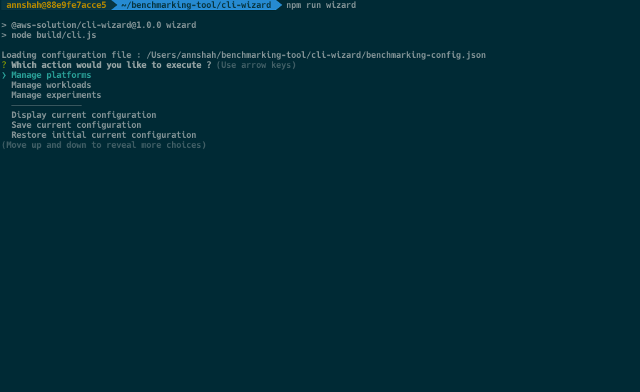

# Benchmarking Tool

> A tool to automate analytic platform evaluations

This tool helps customers to get data points needed for service selection/service configurations for given workload.
Benchmarking tool is created by [AWS Prototyping team (EMEA)](https://w.amazon.com/bin/view/AWS_EMEA_Prototyping_Labs)
based
on [this narrative](https://amazon.awsapps.com/workdocs/index.html#/document/760aa6dceb39082084f710abccf4d973b4156f1ec912acb2270c918656025731)
.

## 📋 Table of content

- [Description](#-description)
- [Use cases](#-use-cases)
- [Pre-requisites](#-pre-requisites)
- [Installing](#-installing)
- [Deployment](#-deployment)
- [Quickstart](#-quickstart)
- [See Also](#-see-also)

## 🔰 Description

This tool will deploy [cdk](https://aws.amazon.com/cdk/) stack which is used to run benchmarking experiments. The
experiment is a combination of [platform](./cdk-stack/platforms) and [workload](./cdk-stack/workloads) which can be
defined using [cli-wizard](./cli-wizard) provided by the tool. Example running experiment in QuickStart.

## 🛠 Use cases

- Comparison of tool performance: Redshift vs Redshift Spectrum
- Comparison of configurations: Redshift dc2 vs ra3 node type
- Performance impact of feature: Redshift AQUA vs Redshift WLM
- Right tool for the job selection: Athena vs Redshift for given workload
- [Registering your custom platform](./cdk-stack/platforms): Redshift vs My Own Database
- [Registering your custom workload](./cdk-stack/workloads): My own dataset vs Redshift

Benchmarking tool supports below combinations as experiment

- Supported platforms:
    - [Redshift](./cdk-stack/platforms/redshift)
    - [Redshift Spectrum](./cdk-stack/platforms/redshift)
- Supported workloads:
    - [TPC-DS/v3](./cdk-stack/workloads/tpc-ds)

## 🎒 Pre-requisites

- [mvn](https://maven.apache.org/install.html) with JDK 8 in PATH
- [npm](https://nodejs.org/en/download/)
- cdk cli: `npm install -g aws-cdk`
- [aws cli](https://docs.aws.amazon.com/cli/latest/userguide/cli-chap-install.html) configured for target AWS_ACCOUNT &
  AWS_REGION for deploying the tool
- [jq](https://stedolan.github.io/jq/download/) tool installed & added in PATH

## 🚀 Installing

1. Clone the repository https://gitlab.aws.dev/aws-emea-prototyping/data-analytics/reusable-assets/aws-placeholder
2. Go to the folder benchmarking-tool `cd aws-placeholder/benchmarking-tool`

## 🎮 Deployment

Set below environment variables if not set already in bash/cli session

```bash
# For Linux or MacOS
# Example:
# export CDK_DEPLOY_ACCOUNT=123456789
# export CDK_DEPLOY_REGION=eu-west-1
export CDK_DEPLOY_ACCOUNT=Aws account id to deploy the tool
export CDK_DEPLOY_REGION=Aws region to deploy the tool

# For Windows
SET CDK_DEPLOY_ACCOUNT=Aws account id to deploy the tool
SET CDK_DEPLOY_REGION=Aws region to deploy the tool
```

With aws cdk cli installed, run deploy

```shell
./deploy.sh # For Linux or MacOS use deploy.sh, For Windows use deploy.bat
```

Once `BenchmarkingStack` is deployed successfully run cli-wizard to run experiments.

```shell
# Set CDK_DEPLOY_ACCOUNT, CDK_DEPLOY_REGION again if using different terminal window
cd cli-wizard
npm run wizard
```

## 🎬 Quickstart



## 👀 See Also

- [Architectural & design concepts](./Concepts.md) driving this project
- [Benchmarking Stack](./cdk-stack) infrastructure
- [Cli Wizard](./cli-wizard)
- How to [add new platform support](./cdk-stack/platforms)
- How to [add new workload support](./cdk-stack/workloads)
